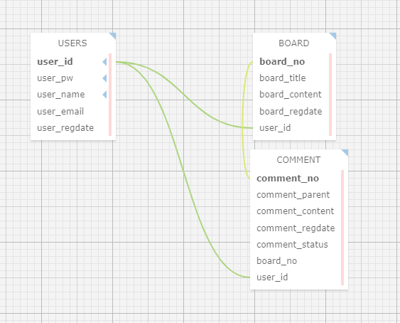

# <div align="center"> SERVER </div>

<div align="center">

Anonymous Server

account, login, board, comment CRUD 기능을 간단하게 적용하여 구현한 게시판입니다. 서버에서는 JSON 형태로 클라이언트에게 전송합니다. 현재 지원 가능한 HTTP 메소드는 DELETE, POST, GET, PATCH 가 있으며, 메소드를 통해 테스트 해보실 수 있습니다.

</div>

<br>

## ERD



<br>

## Step

1. Maria-DB를 설치합니다.
2. .env 파일에 디비를 설정합니다.
3. 아래 쿼리문을 실행하여 데이터베이스 및 테이블을 생성해주세요.

```sql
-- 데이터베이스 생성
create database Anonymous
```

```sql
-- 유저 테이블 생성
CREATE TABLE USERS ( user_id VARCHAR(100) NOT NULL, user_pw VARCHAR(200) NOT NULL, user_name VARCHAR(100) NOT NULL, user_email VARCHAR(100), user_regdate DATE, primary key (user_id) );
```

```sql
-- 게시판 테이블 생성
CREATE TABLE BOARD ( board_no INT(10) NOT NULL AUTO_INCREMENT PRIMARY KEY, board_title VARCHAR(200) NOT NULL, board_content TEXT(65535) NOT NULL, board_regdate DATE, user_id  VARCHAR(100) NOT NULL, FOREIGN KEY(user_id) REFERENCES USERS(user_id) );
```

```sql
-- 댓글 테이블 생성
create table COMMENT ( comment_no INT(10) NOT NULL AUTO_INCREMENT PRIMARY KEY, comment_parent INT(10) DEFAULT NULL, comment_content TEXT(65535) NOT NULL, comment_regdate DATE NOT NULL, comment_status CHAR(1) DEFAULT 'Y', board_no INT(10) NOT NULL, user_id VARCHAR(100) NOT NULL, FOREIGN KEY(board_no) REFERENCES BOARD(board_no) on delete cascade , FOREIGN KEY(user_id) REFERENCES USERS(user_id) on delete cascade);
```

<br>

4. node 설치 후 패키지를 설치합니다.

```sh
npm install --save
npm install -g nodemon ts-node
```

<br>

5. 서버를 실행합니다.

```sh
npm start
```
